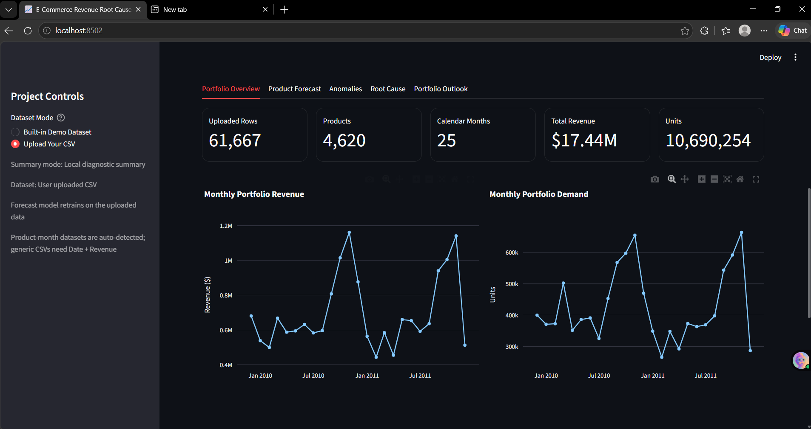
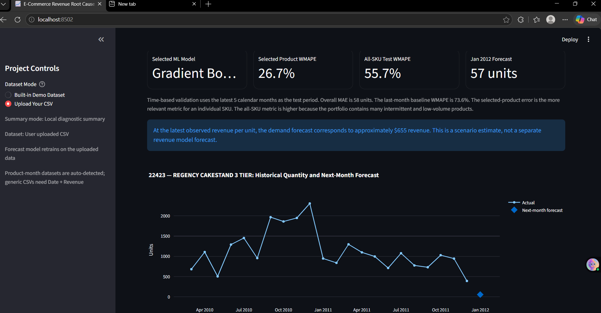
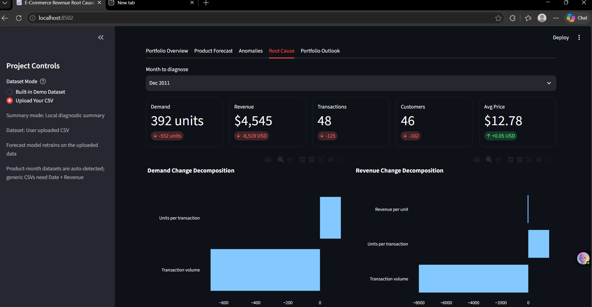

# E-Commerce Revenue Root Cause & Forecasting System

This project analyzes e-commerce data to understand revenue and product demand, detect unusual changes, and forecast future performance.

It is built using Python, SQL, Pandas, scikit-learn, Plotly, and Streamlit.

## Project Preview

### Portfolio Overview



### Product Forecast



### Root Cause Analysis



## What This Project Does

The application has two modes:

### Built-in E-Commerce Analysis

The built-in dataset is used to analyze:

- Revenue
- Orders
- Sessions
- Conversion rate
- Average order value
- Marketing sources
- Product performance
- Revenue anomalies
- Revenue forecasting
- Root-cause analysis

### Upload Product Data

The user can also upload a product-level monthly CSV file.

The application can then:

- Forecast next-month product demand
- Forecast next-month revenue
- Compare ML models with a simple baseline
- Detect unusual demand or revenue changes
- Analyze why demand or revenue increased or decreased
- Generate portfolio-level forecasts
- Export forecast results to CSV

## Dataset Format

The product forecasting mode supports data with columns such as:

```text
StockCode
Description
Month
Quantity
Revenue
Transactions
Customers
Avg_Price